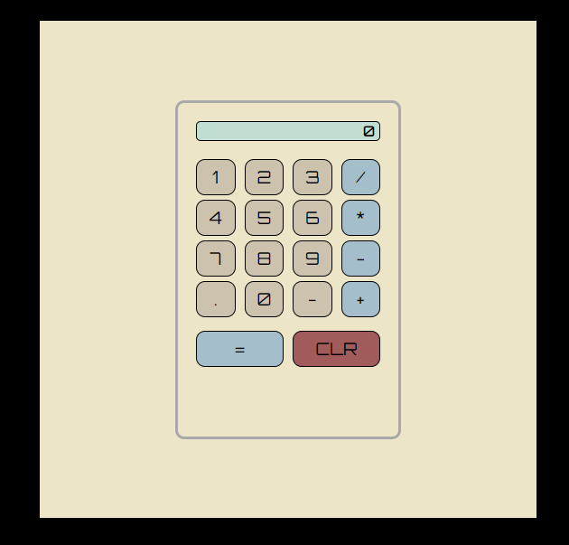

# Calculator App

I have coded a simple calculator application using React. The app follows the criteria laid out in the [freeCodeCamp](https://www.freecodecamp.org/learn/front-end-development-libraries/front-end-development-libraries-projects/build-a-javascript-calculator) challenge and uses expressive logic.

## Built With
* React
* Flexbox
* Grid

## What I Did
Before starting this project I read a line that in web development first you build the outline, where you spend a little time thinking and a lot of time coding, then you add the logic where the reverse is true. That was definitely the case here where I was able to create the display using hard coded content quite quickly.

With adding the logic I broke the challenge down into two main parts: handling the updated input for each button click other than "equals" and handling the calculation once "equals" was pressed. In both cases I was able to come up with an outline solution to the problem which was most of the way there but then had to tackle specific challenges and esge cases as I progressed through.

A particular challenge was finding a way to treat the subtration and negative number buttons differently which I solved using u2212 and the unicode delimiter of regex.

## What I Learned
This project mostly used skills which I already had such as loops, logic operators and regex but applied them in a more involved way that I had on any self-led project to date. One specific thing I did learn was the use of the unicode delimiter of regex.

## Future Work
Some areas of this program which I think could be improved are:
* Error handling - I use logic functions to handle some errors at the point where they occur but refactoring into try-catch might be beneficial.
* Elegance - the updateDisplay function in particular is done with brute force logic and it may be possible to implement something more elegant and simpler when I have a deeper understanding of React.